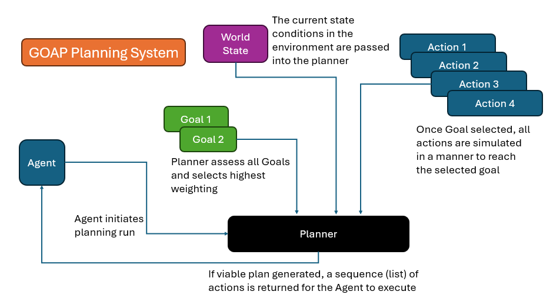

###### Readme top

<br />
<div align="center">
  <a href="http:\\excaliburjs.com">
    
  </a>

  <h3 align="center">Excalibur GOAP Planner</h3>

  <p align="center">
    A library module that provides convenience classes for building an NPC's AI patterns for a game.  Based on the Goal Oriented Action Planning (GOAP).
    <br />
    
  </p>
</div>

<!-- TABLE OF CONTENTS -->
<details>
  <summary>Table of Contents</summary>
  <ol>
    <li><a href="#about-the-library">About The Library</a></li>
    <li><a href="#how-does-goap-work">How does GOAP work?</a></li>
    <li><a href="#getting-started">Getting Started</a></li>
    <li><a href="#types-defs">Type Definitions</a></li>
    <li><a href="#main-api">Main API</a></li>
    <li><a href="#utility-methods">Utility Methods</a></li>
    <li><a href="#contact">Contact</a></li>
    <li><a href="#acknowledgments">Acknowledgments</a></li>
  </ol>
</details>

<!-- ABOUT THE PROJECT -->

## About The Library

[live demo](https://mookie4242.itch.io/goap-ai-simulation-using-excaliburjs-engine)

This Library consists of Agenst, Actions, Goals, and a Planner. Agents are Excalibur Actors that gain new properties to facility NPC
action planning. Based on the Goals and Actions provided, the Planner will create a series of events to be executed by the agent.

In the API:

- GOAPAgent Class -> extenstion of Excalibur Actors that have the plubming provided to run autonomously
- GOAPAction Class -> Actions that have preconditions, state effects, action callbacks that run on NPC's
- GOAPGoal Class -> a class that contains the prioritization (weighting) and target state evaluation callback needed to form a plan
- GOAPPlanner -> The planner takes in the goals, actions, and the current state condition and spits out a viable plan that meets the
  goal, if feasible.

Utilities:

- GOAP_UUID - unique identifier for graph nodes
- GOAP_PlanReport - a dev tool that spits out the inner details of how a planner processes the inputs

<p align="right">(<a href="#readme-top">back to top</a>)</p>

## How does GOAP work

 

<!-- GETTING STARTED -->

## Getting Started

At the moment, its just a library module, so you can pull down the GOAP.ts

First, you need to create a GOAPGoal:

The details of each class i'll dive into deeper further down.

```ts
// Goal.ts
import { GoapGoal, GoapGoalConfig, actionstate } from "../GOAP";
import { goal } from "../Goal";

const goalConfig: GoapGoalConfig = {
  name: "keepfirealive",
  targetState: (s: actionstate) => {
    return s.campfire > 0 && s.player == 0;
  },
  weighting: (s: actionstate) => {
    if (s.campfire <= 20) return 0.9;
    return 0.0;
  },
};
export const goal = new GoapGoal(goalConfig);
```

<p align="right">(<a href="#readme-top">back to top</a>)</p>

Next on your journey create a GOAPAgent, an Excalibur Actor with additional properties.

```ts
// Player.ts
import { GoapAgent, GoapAgentConfig } from "../GOAP";

const playerActorConfig: ActorArgs = {
  name: "player",
  pos: new Vector(300, 250),
  width: 16,
  height: 16,
  color: Color.Blue,
};

const playerConfig: GoapAgentConfig = {
  world: world,
  state: {},
  actions: [],
  goals: [goal, avoidBearGoal],
  actorConfig: playerActorConfig,
  delayedPlanning: 10,
  debugMode: false,
};

export const player = new GoapAgent(playerConfig);
```

<p align="right">(<a href="#readme-top">back to top</a>)</p>

Then you need to build out all your actions that are available to evaluate by the planner.

```ts
// feedFire.ts
import { Blink, ActionCompleteEvent } from "excalibur";
import { GoapAction, GoapActionConfig, GoapAgent, actionstate } from "../GOAP";
import { player } from "../../Actors/Player";
import { playerState } from "../World/world";

const myAction = (player: GoapAgent, currentAction: GoapAction, world: actionstate): Promise<void> => {
  return new Promise(resolve => {
    const actionSub = player.events.on("actioncomplete", (e: ActionCompleteEvent) => {
      if (e.target === player && e.action instanceof Blink) {
        actionSub.close();
        resolve();
      }
    });
    player.actions.blink(250, 250, 1);
  });
};

const actionConfig: GoapActionConfig = {
  name: "feedFire",
  cost: () => {
    return 1;
  },
  timeout: 2000,
  effect: world => {
    if (world.player != 0) {
      world.player -= 5;
      world.campfire += 5;
    }
    world.playerState = playerState.feedingFire;
    if (world.player <= 0) {
      world.playerState = playerState.idle;
    }
  },
  precondition: world => {
    let isPlayerEmpty = world.player == 0;
    let isPlayerReadyToFeedFire = world.playerState === playerState.movingToFire || world.playerState === playerState.feedingFire;
    return !isPlayerEmpty && isPlayerReadyToFeedFire;
  },
  action: myAction,
  entity: player,
};

export const feedFireAction = new GoapAction(actionConfig);
```

<p align="right">(<a href="#readme-top">back to top</a>)</p>

so in your main part of the program, you'll add the player actor to your scene and run the Excalibur engine.

```ts
// main.ts
// ... other code
await game.start();
game.add(player);
player.initalize(); // triggers GOAP to load planner
player.startGOAP(); // turns on the planning engine
```

<p align="right">(<a href="#readme-top">back to top</a>)</p>

### Types Defs

#### ActionState

This is a key/value pair that represents the world state that the Planner uses to create a plan

```ts
export type actionstate = Record<string, any>;
```

#### EffectCallback

This is the routine that modifies the world state AFTER the action event is completed

```ts
export type effectCallback = (worldstate: actionstate, agentState?: actionstate) => void;
```

<p align="right">(<a href="#readme-top">back to top</a>)</p>

#### PreconditionCallback

This is a routine that is ran, and returns a true or false based on the given logic, where a true return allows for this action, under
the state conditions, should be available to run... a false disqualifies an action from being included in the planning

```ts
export type preconditionCallback = (worldstate: actionstate, agentState?: actionstate) => boolean;
```

#### ActionCallback

This routine is what is actually executed when this action is ran. it returns a promise when the action is resolved. Examples of
actions are blinking characters, moving actors, etc...

<p align="right">(<a href="#readme-top">back to top</a>)</p>

```ts
export type actionCallback = (actionEntity: GoapAgent, action: GoapAction, worldstate: actionstate) => Promise<void>;
```

#### CostCallback

This routine is what gets ran when the corresponding actions are evaluated for the cheapest path calculation. It returns a unitless
value indicating the cost.

```ts
export type costCallback = (actionEntity: GoapAgent, worldstate: actionstate) => number;
```

<p align="right">(<a href="#readme-top">back to top</a>)</p>

### ActionStatus

This enum represents the status of an action: busy - Executed action is still processing waiting - Action has not started executing
complete - Action has resolved

```ts
export enum GoapActionStatus {
  waiting,
  complete,
  busy,
}
```

<p align="right">(<a href="#readme-top">back to top</a>)</p>

### Main API

#### Agents

##### Interface

```ts
export interface GoapAgentConfig {
  world: actionstate;
  actions: GoapAction[];
  goals: GoapGoal[];
  actorConfig: ActorArgs;
  delayedPlanning?: number;
  debugMode?: boolean;
}
```

world is the action state object that is where the world state is being kept

actions, is the list of available actions that the planner can choose from goals, are the set of GOAPGoal objects that get selected
from

actorConfig, is the ActorArgs from Excalibur for setting up an Actor

delayedPlanning (optional, default 0): number of loops prior to executing a planning run, i.e. slows down the planning

debugMode (optional, default false), if true, runs one planning session, and console logs out the report of the planning run

##### Class

```ts
/**
 * @description - Class for GOAP agent
 * @param input - Input configuration for the agent.
 * @method cancelPlan - cancels the current plan
 * @method onPostUpdate - on post update (game loop update)
 * @method initialize - setups up the Planner configuration
 * @method startGOAP,stopGOAP - sets/clears the isRunning flag
 * @getter isGOAPRunning - returns the isRunning flag
 */
```

cancelPlan() - resets all actions and clears out the plan buffer

onPostUpdate() - update method called by the gameloop, if no plan exists AND the plannign delay

conditions are met, runs a planning session with the current worldstate

initialize() - sets up the planner to run, must be called before any planning happens

#### Goals

##### Interface

```ts
export interface GoapGoalConfig {
  name: string;
  targetState: (s: actionstate) => boolean;
  weighting: (s: actionstate) => number;
}
```

name is a unique string identifier targetState is the world state elements and their desired values for a plan to be completed,
returnsa true/false, true meaning the Goal has been reached

weighting is a callback that returns a floating point number (0.0-1.0) representing how high of a priority the goal is under current
state condistions that are passed in

##### Class

```ts
/**
 * @description - Class for GOAP goal
 * @param input - Input configuration for the goal.
 * @method getPriority - get priority for this goal
 */
```

getPriority(), returns the weighting score for this goal, used by the planner to select best available goal to accomplish

#### Actions

##### Interface

```ts
export interface GoapActionConfig {
  entity: GoapAgent;
  name: string;
  cost: costCallback;
  effect: effectCallback;
  precondition: preconditionCallback;
  action: actionCallback;
  timeout?: number;
}
```

entity - the owner GoapAgent who has this plan name - unique identifying string for the Action cost - a

costCallback that returns the numeric, unitless 'cost' for performing this action effect - effectCallback that executes AFTER the
action is completed, and itmodifies the worlddate precondition -

preconditionCallback that executes early in the planning stage and returns boolean dictating if the action is available to be
considered in the planning

action: actionCallback, async callback that actually executes when the overall plan is being processed

timeout (optional, default -1): if this parameter is passed, representing how many milliseconds to wait until the action times out and
cancels

##### Class

```ts
/**
 * @description - Class for GOAP action
 * @param input - Input configuration for the action.
 * @method cancel - cancels the action
 * @method reset - resets the action
 */
```

cancel, this is what is called in your program to cancel a plan

reset, set's the state of the action back to waiting

#### Planner

##### Interface

```ts
export interface GoapPlannerConfig {
  agent: GoapAgent;
  world: actionstate;
  goals: GoapGoal[];
  actions: GoapAction[];
  mode?: boolean;
}
```

##### Class

```ts
/**
 * @description - Class for GOAP planner
 * @param input - Input configuration for the planner.
 * @method plan - starts building the plan, returns array of actions
 */
```

plan() is called by the Agent, when there is no available plan to execute

### Utility Methods

#### UUID

```ts
const myUUID = GOAP_UUID.generate();
```

This static class/method creates a unique identifer

#### Planning Report

```ts
GOAP_PlanReport.generate();
```

This static method is what spits out the consoled report for the planning run.

<p align="right">(<a href="#readme-top">back to top</a>)</p>

## Contact

Justin Young - [@jyoung424242 (Twitter)](https://twitter.com/your_username) - [Mookie4242 (itch.io)](https://mookie4242.itch.io/)

Project Link: [GitHub Repo: Ex-GOAP-test](https://github.com/jyoung4242/Ex-GOAP-test)

<p align="right">(<a href="#readme-top">back to top</a>)</p>

<!-- ACKNOWLEDGMENTS -->

## Acknowledgments

Special thanks to two great communities that are always available to jump in help, and inspire little projects like these!!!!

- [Excalibur Discord](https://discord.gg/yYY6hGVTf5)
- [Game Dev Shift Discord](https://discord.gg/BZMcuR3FBD)

<p align="right">(<a href="#readme-top">back to top</a>)</p>
